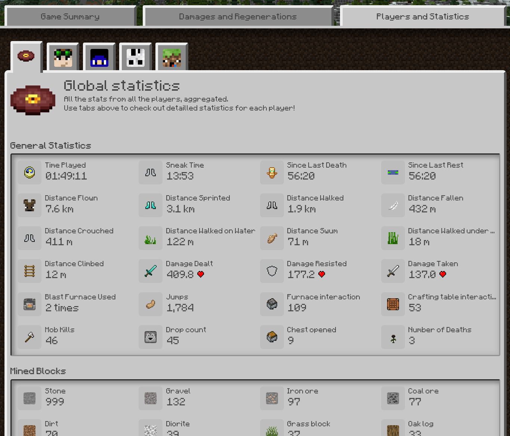

+++
title = "Hawk"
description = "Hawk — Beautiful reports for your games"
insert_anchor_links = "right"

[extra]
repo = "https://github.com/zDevelopers/Hawk"
links = [
{ title = "Spigot", url = "https://www.spigotmc.org/resources/hawk.91426" },
{ title = "Javadoc", url = "/docs/hawk/" }
]
+++

Hawk is a game report system, typically for competitive Minecraft game, but it is very flexible and adapts to a wide
range of uses. Run a command on your server or integrate it to your game plugin with a few lines of code; then, like a
hawk, it'll track everything players do and generate on-demand a beautiful web report. Give  the link to the players, so
they can see how they performed and share their game with their friends!

You can also add to it special events that may happen during your game.

A [real-life game report](https://hawk.carrade.eu/65m7j2x6) is available, if you want to see what it's like. We provide
hosting, but you can host a web instance if you prefer to.

Hawk is available in two flavours:

- one for **server owners** who want to record their games without headache: it's a small plugin to install;
- one for **Bukkit plugins developers** who want to automatically generate reports for the games they are creating wit
  a very simple API.

Hawk for server owners
Hawk for developers

# Features

Hawk generate reports with three main sections:

- **Game Summary**, with all players and a timeline to get the game at a glance;
- **Damages and Regenerations**, where you can see a condensed recap of all damages and heals during the game, including
  deaths and creature damages;
- **Players and Statistics**, where global and per-player statistics are displayed, alongside specific infos for players
  like Hawk tags.

The Hawk UI is translated in English and French, an an Italian translation was started (thanks zDragon_YT!). [If you want
to contribute with additional translations, click this link!](https://poeditor.com/join/project?hash=0W06oCXfrR)

A lot of things are configurable [if you integrate Hawk with your plugin](https://dev.zcraft.fr/docs/hawk/index.html?me/cassayre/florian/hawk/report/ReportSettings.html).
As example, you can disable sections, configure what is displayed in each of them, highlight some statistics that are
important for your games…

_Advanced settings are only available through the developers API._

## Game Summary

A timeline feature important game events—plugin developers can add their own as they want. Alongside, all players of
the game are displayed. Clicking on them go to the players tab where details and statistics are listed.

_The plugin version only generate death events. Custom events can only be created through the developers API currently._

You have teams? We got you covered. Hawk reports can include teams—the players pane will display them, and players will
have a colored border according to their team in other sections.

## Damages and Regenerations

This section list everything that happened to players—including details on the weapons used by mobs or other players.
Hover any tool or player and you'll get details on what was used!

Under the players summaries, environmental damages are aggregated. Damn, lava and fire were hard for players on this
game!

## Players and Statistics

On the third tab, players statistics during the game session are displayed, as well as aggregated global statistics.

If you know some statistics are more important than others to get what a player did at a glance, you can highlight some
of them—everything else is still available under the “Show all” button.

[You can also see a player tag, used to add some more information.](hawk/developers/#adding-light-metadata-tags-on-players)
Here, this player was in an alliance with a specific player, in an UHC scenario where alliances can be created when
players meet—, but you can use this for anything you want!

_[Tags](hawk/developers/#adding-light-metadata-tags-on-players) and statistics highlight are only available through the developers API._

## Exports

Report data is available as JSON format—add `.json` to a report URL to get a machine-readable representation. The link
is also available in the footer.
