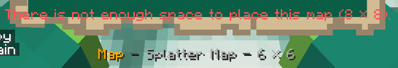

+++
title = "FAQ | ImageOnMap"
description = "ImageOnMap frequently asked questions"

[extra]
menu_title = "Frequently Asked Questions"
+++

Answers to frequently asked questions. Please check these before asking on Discord, Spigot, GitHub, or others!

---

# What kind of link I can use with `/tomap`?

You can use any publicly-accessible link from the internet that is a **direct link** to a PNG, JPG, JPEG or GIF file.

Some examples:

- this link, a direct link to an image, is valid: [`https://upload.wikimedia.org/wikipedia/commons/2/21/Acme_klein_bottle.jpg`](https://upload.wikimedia.org/wikipedia/commons/2/21/Acme_klein_bottle.jpg)
- this link, a link to a Wikimedia Commons page for the image, is not, as it's a link to a *webpage containing the image*: [`https://commons.wikimedia.org/wiki/File:Acme_klein_bottle.jpg`](https://commons.wikimedia.org/wiki/File:Acme_klein_bottle.jpg)
- this link, a direct link to an image, is valid: [`https://i.imgur.com/MT0Ruv9.png`](https://i.imgur.com/MT0Ruv9.png)
- this link, a link to the imgur webpage containing the image, is not: [`https://imgur.com/MT0Ruv9`](https://imgur.com/MT0Ruv9)

If the `/tomap` command errors with “The given URL is not a valid image”, you probably gave a wrong link, to something else than a image directly.

**To check that, make sure there is no webpage around the image.** You can also right-click the image you want and select “Copy image URL” (or similar) to get the direct link to the image in your clipboard.

---

# I get `HTTP error: 404 Not Found`. What does it means and what can I do?

This means ImageOnMap was unable to find an image at the URL you given. Double-check the spelling, and ensure the image still exist. If nothing work, you can try to re-host the file somewhere else—[you can use imgur](https://imgur.com/upload?beta), for example.

---

# What about `HTTP error: 403 Forbidden`?

When you import an image using `/tomap`, ImageOnMap asks the image's host to get the file so it can display it on your Minecraft server. This error means the web server said “sorry but no, I will not give you this image”. That's not very nice.

Although we have added some workarounds to avoid this problem in common cases, ImageOnMap cannot force a web server to send the file if it is a bit stubborn. In this case, your only option is to re-host the image you want to send. [You can use imgur](https://imgur.com/upload?beta), for example.

The same tip apply for any error message starting with `HTTP error`, except for 404, as explained above.

---

# Can I send GIFs?

Yes, but they won't animate.

---

# I sent a big image and ImageOnMap gave me a “splatter map”. What's that, and how can I use it?

To display big images on a server using maps, you'll have to place a lot of maps together on a wall, with a small part of the image on everyone of them. That's boring.

A splatter map will do that for you: it contains as many maps as needed to render the image you sent. To use them, place on a wall, a floor or a ceiling, as many item frames as needed (the amount required is written on the splatter map's tooltip), then place the map like any map on the bottom-left corner of the item frames. ImageOnMap will place all other maps for you.

To remove the whole poster at once, remove any map from it while sneaking.

---

# Can I resize the image automatically?

Yes.

- If you want to resize the image so it fit in a single map, add `resize` at the end of the command: `/tomap <url> resize`.
- If you want the image to _cover the whole frame_, you have two options:
   - you can stretch the image over the map (will distort it!) using `/tomap <url> resize-stretched`;
   - you can cover the whole map without distortion by zooming the image until no blank margin is left (will lose some borders of the image) using `/tomap <url> resize-covered`.

All of this is to resize the image to a single map. If you want to resize it to multiple maps, add the width and height at the end. As example, if you want to resize an image to a 4×2 blocs surface (width × height), ensuring the whole surface is covered without distortion, use `/tomap <url> resize-covered 4 2`.

---

# I want to craft images specifically for Minecraft. What is the corresponding size of a single map?

128px × 128px.

---

# Colours are bad! What can I do?

Sadly, Minecraft cannot render all colours. We are limited to [a small subset of colours listed on this page](https://minecraft.gamepedia.com/Map_item_format#Color_table). We try to approximate colors as best as we can but we're aware that's not always perfect.

The next version will feature _dithering_, a technical process to optimise the colours used to render the map. That will enhance the overall quality of all images, including past ones.

---

# ImageOnMap is way too open. Can I restrict its usage?

Yes, if your permissions plugin allows to negate permissions (all of them probably support that). To prevent players to create new images, negate the `imageonmap.new` permission. In most cases, give the `-imageonmap.new` permission to do that.

ImageOnMap is open to every player by default because we want the plugin to be usable directly, even without a permissions plugin.

# ImageOnMap say there is not enough place for a splatter map, but there is and the required size is not consistant

It looks like ImageOnMap index was somehow corrupted. This can happen when the server is badly stopped (e.g. killed). An example is below: the size on the splatter map and on the error message doesn't match.



This seems to be a Bukkit bug we struggle to fix, but for you, the simplest fix is to render a huge map once (a map you won't use), and that rendering should repair ImageOnMap index. Run, as a player:

```
/tomap https://dev.zcraft.fr/logo.png resize 50 50
```

and re-render the previously non-working map.

# When I place an image, every other player in the area cannot see the bottom-left map.

If other players leave the area then go back to it, they should see the whole image. Players must unload the area on their client, so they must go further than the server's rendering distance (usually, 300 blocks is enough).

We hope to find a fix for this, but at least, it's only when the map is placed.

# Host-specific questions

## I'm using Minehut and ImageOnMap doesn't work.

Minehut, a Minecraft server hosting plateform, disabled for security reasons a component called _JavaScript Engine_ around April 2nd, 2021. The translation system powering ImageOnMap use this engine to handle plurals, and with the engine unavailable, ImageOnMap was unable to run.

Actually, all QuartzLib-based plugins are affected.

For ImageOnMap, Minehut disabled our translations system as a hotfix. We intend to fix this for everyone in an upcoming version (either 4.1 or 4.1.1).

## I'm using Minehut and ImageOnMap miss some features.

It looks like Minehut use a fork of ImageOnMap, instead of the version we build. In their version, internationalization is disabled: you won't be able to use ImageOnMap in all languages supported; only English remain.

We intend to fix this for everyone in an upcoming version (either 4.1 or 4.1.1).

## I'm using PloudOS and the plugin doesn't work

To block shop plugins, PloudOS, a Minecraft host, blocked Internet access for all plugins. That means any plugin that access the Internet won't work correctly—including the `/tomap` command, because it download images from… the Internet. There is nothing we can do on our side—they told us they intent to fix this someday but they have no ETA.
